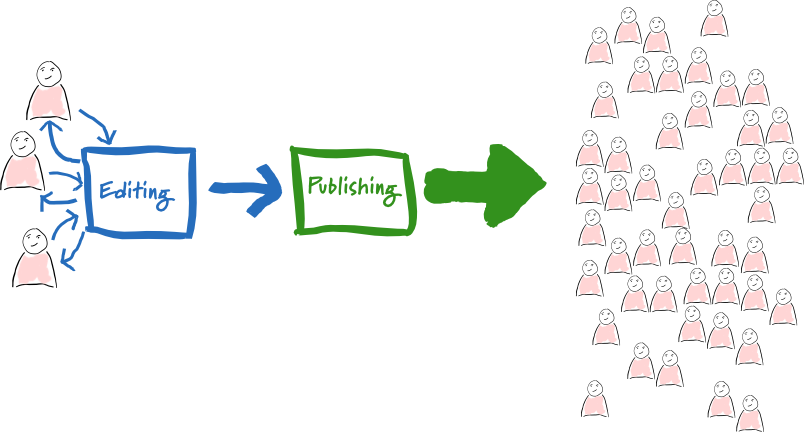
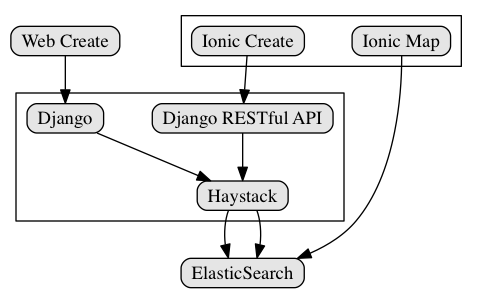

前言
===

工作两年过去了， 我发现我也学习、实践了一些架构方面的知识。原本我并没有意识到我也可以总结这方面的结识——对于一个刚工作两年的人来说，这有点出乎意料。总结对于自己来说，是一个非常有益的过程。只有当我们总结了自己的知识时，我们才能意识到我们学习到了怎样的知识。

关于架构方面的书籍有相当的多，这只是我对于我所知道并实践过的架构知识的总结。换句话来说，这是我的又一次[RePractise](https://github.com/phodal/repractise)。

分层
===

分层[^1]是最常见的架构模式了。在我们的生活中，这也是很常见的一种设计模式。

//TODO 需要一个例子


图为表示层、业务逻辑层、数据访问层

MVC
---

下图亦为上中所说的分层结构：


### 项目结构

体现在项目目录结构上的分层，如下是常见的Spring MVC项目的目录结构

 - controller
 - interceptor
 - model
 - service
 - mapper
 - transform

类似的还有，Ruby On Rails的目录结构：

 - assets
 - controllers
 - helpers
 - mailers
 - models
 - views

从这些结构里，我们可以看到xx

当然，也会有一些更有趣的例子，如Python的Django默认的是这样的结构：

```shell
.
├── accounts
│   ├── __init__.py
│   ├── migrations/
│   ├── models.py
│   ├── urls.py
│   └── views.py
└── aggregator
    ├── __init__.py
    ├── admin.py
    ├── management/
    ├── migrations/
    ├── models.py
    └── views.py
```

实践
---

可惜的是，我对Spring MVC已经有些疏远了，在搭建的过程中经常犯一些新手错误。

### Spring MVC

[^1]: 让我们致敬Martin Fowler的《企业应用架构模式》

读写分离
===

读写分离有一个常见的实践就是页面缓存。我们使用缓存服务器对用户常访问的内容进行缓存，如变成静态文件。这时候它就是一个很简单的读写分离。

页面缓存
---


编辑-发布分离
---

编辑-发布分离[^EditingPublishingSeparation]

让我愉快地盗张图：




[^EditingPublishingSeparation]: 即Editing Publishing Separation，出自于Martin Fowler的相关文章 [EditingPublishingSeparation](http://martinfowler.com/bliki/EditingPublishingSeparation.html)

命令与查询职责分离
===

命令与查询职责分离主要用于那些查询多，而插入少的应用程序，如搜索网站等等。网站客户的数据、网站用户使用的持久化数据中心不是同一个，如我们可以SQL来存储客户的数据，通过消息队列将数据导入搜索引擎中，提供给网站用户使用。

CQRS
---


Django CQRS
---




 - 当用户、管理员创建或者更新新的对象时，对象将被保存到数据。并且依据我们对HayStack的设定，我们将会即时或定时将数据索引到ElasticSearch中。
 - 当用户搜索时，通过ElasticSearch来进行搜索。

在这个过程中，我们主要依赖于HayStack作为Message Queue来将数据从数据库导入搜索引擎。

MySQL / SQL Server + ElasticSearch

静态
===

静态是最好的解
---

GitHub Page
---

下图是基于Jekyll的GitHub Page的生成过程[^jekyll]


静态网站生成
---


编辑-发布-分离
---

如React一样解决DOM性能的问题就是跳过DOM这个坑，要跳过动态网站的性能问题就是让网站变成静态。

越来越多的开发人员开始在使用Github Pages作为他们的博客，这是一个很有意思的转变。主要的原因是这是免费的，并且基本上可以保证24x7小时是可用的——当且仅当Github发现故障的时候才会不可访问。

在这一类静态站点生成器(Github)里面，比较流行的有下面的内容（数据来源： http://segmentfault.com/a/1190000002476681）:

1. Jekyll / OctoPress。Jekyll和OctoPress是最流行的静态博客系统。
2. Hexo。Hexo是NodeJS编写的静态博客系统，其生成速度快，主题数量相对也比较丰富。是OctoPress的优秀替代者。
3. Sculpin。Sculpin是PHP的静态站点系统。Hexo和Octopress专注于博客，而有时候我们的需求不仅仅是博客，而是有类似CMS的页面生成需求。Sculpin是一个泛用途的静态站点生成系统，在支持博客常见的分页、分类tag等同时，也能较好地支持非博客的一般页面生成。
4. Hugo。Hugo是GO语言编写的静态站点系统。其生成速度快，且在较好支持博客和非博客内容的同时提供了比较完备的主题系统。无论是自己写主题还是套用别人的主题都比较顺手。

通常这一类的工具里会有下面的内容：

1. 模板
2. 支持Markdown
3. 元数据

如Hexo这样的框架甚至提供了一键部署的功能。

在我们写了相关的代码之后，随后要做的就是生成HTML。对于个人博客来说，这是一个非常不错的系统，但是对于一些企业级的系统来说，我们的要求就更高了。如下图是Carrot采用的架构：


这与我们在项目上的系统架构目前相似。作为一个博主，通常来说我们修改博客的主题的频率会比较低， 可能是半年一次。如果你经常修改博客的主题，你博客上的文章一定是相当的少。

上图中的编辑者通过一个名为Contentful CMS来创建他们的内容，接着生成RESTful API。而类似的事情，我们也可以用Wordpress + RESTful 插件来完成。如果做得好，那么我想这个API也可以直接给APP使用。

上图中的开发者需要不断地将修改的主题或者类似的东西PUSH到版本管理系统上，接着会有webhook监测到他们的变化，然后编译出新的静态页面。

最后通过Netlify，他们编译到了一起，然后部署到生产环境。除了Netlify，你也可以编写生成脚本，然后用Bamboo、Go这类的CI工具进行编译。

通常来说，生产环境可以使用CDN，如CloudFront服务。与动态网站相比，静态网站很容易直接部署到CDN，并可以直接从离用户近的本地缓存提供服务。除此，直接使用AWS S3的静态网站托管也是一个非常不错的选择。

重新设计一个基于GitHub的系统如下：


从我们设计系统的角度来说，我们会在Github上有三个代码库：

1. Content。用于存放编辑器生成的JSON文件，这样我们就可以GET这些资源，并用Backbone / Angular / React 这些前端框架来搭建SPA。
2. Code。开发者在这里存放他们的代码，如主题、静态文件生成器、资源文件等等。
3. Builder。在这里它是运行于Travis CI上的一些脚本文件，用于Clone代码，并执行Code中的脚本。

以及一些额外的服务，当且仅当你有一些额外的功能需求的时候。

1、 Extend Service。当我们需要搜索服务时，我们就需要这样的一些服务。如我正考虑使用Python的whoosh来完成这个功能，这时候我计划用Flask框架，但是只是计划中——因为没有合适的中间件。
2. Editor。相比于前面的那些知识这一步适合更重要，也就是为什么生成的格式是JSON而不是Markdown的原理。对于非程序员来说，要熟练掌握Markdown不是一件容易的事。于是，一个考虑中的方案就是使用 Electron + Node.js来生成API，最后通过GitHub API V3来实现上传。

So，这一个过程是如何进行的。


整个过程的Pipeline如下所示：

1. 编辑使用他们的编辑器来编辑的内容并点击发布，然后这个内容就可以通过GitHub API上传到Content这个Repo里。
2. 这时候需要有一个WebHooks监测到了Content代码库的变化，便运行Builder这个代码库的Travis CI。
3. 这个Builder脚本首先，会设置一些基本的git配置。然后clone Content和Code的代码，接着运行构建命令，生成新的内容。
4. 然后Builder Commit内容，并PUSH内容。


[^jekyll]: 引自http://jekyllbootstrap.com/


微服务
===

微内核与宏内核
---

> 单内核：也称为宏内核。将内核从整体上作为一个大过程实现，并同时运行在一个单独的地址空间。所有的内核服务都在一个地址空间运行，相互之间直接调用函数，简单高效。微内核：功能被划分成独立的过程，过程间通过IPC进行通信。模块化程度高，一个服务失效不会影响另外一个服务。Linux是一个单内核结构，同时又吸收了微内核的优点：模块化设计，支持动态装载内核模块。Linux还避免了微内核设计上的缺陷，让一切都运行在内核态，直接调用函数，无需消息传递。

>微内核――在微内核中，大部分内核都作为单独的进程在特权状态下运行，他们通过消息传递进行通讯。在典型情况下，每个概念模块都有一个进程。因此，假如在设计中有一个系统调用模块，那么就必然有一个相应的进程来接收系统调用，并和能够执行系统调用的其他进程（或模块）通讯以完成所需任务。

Hurd之死
---


消息队列
===

Cron Job
---

ActiveMQ
---

契约
===

康威定律
---

前后端分离
---

我们在后台使用Spring MVC作为基础架构、Mustache作为模板引擎，和使用JSP作为模板引擎相比没有多大的区别——由Controller去获取对应的Model，再渲染给用户。多数时候搜索引擎都是依据Sitemap来进行索引的，所以我们的后台很容易就可以处理这些请求。同样的当用户访问相应的页面的时候，也返回同样的页面内容。当完成页面渲染的时候，就交由Backbone来处理相应的逻辑了。换句话来说，从这时候它就变成了一个单页面应用。


管道和过滤器
===


Unix管理
---

搜索
---

六边形架构
===


Lan
---


Clean
===

> Clean一般是指，代码以洋葱的形状依据一定的依赖规则被划分为多层：内层对于外层一无所知。这就意味着依赖只能由外向内。


领域
===


领域特定语言
---

DDD
---
