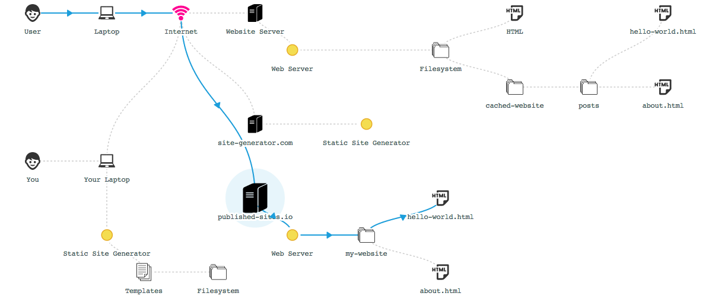
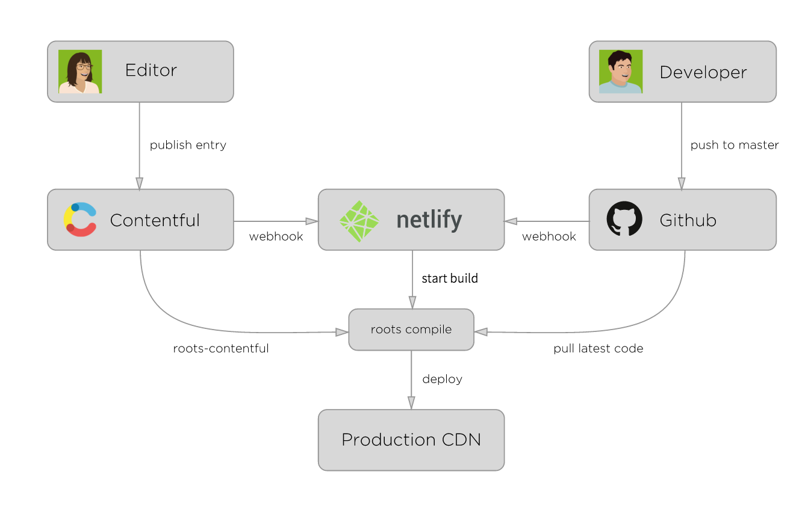
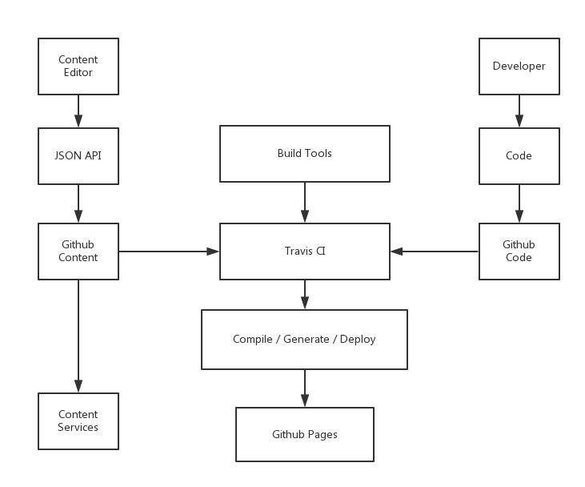

前言
===

工作两年过去了， 我发现我也学习、实践了一些架构方面的知识。原本我并没有意识到我也可以总结这方面的结识——对于一个刚工作两年的人来说，这有点出乎意料。总结对于自己来说，是一个非常有益的过程。只有当我们总结了自己的知识时，我们才能意识到我们学习到了怎样的知识。

关于架构方面的书籍有相当的多，这只是我对于我所知道并实践过的架构知识的总结。换句话来说，这是我的又一次[RePractise](https://github.com/phodal/repractise)。

分层
===

分层[^1]是最常见的架构模式。这种形式的分层在代码中的体现比较明显——我们很容易可以从项目的代码中，毕竟它可以直接体现在项目目录结构上。

如下是常见的Spring MVC项目的目录结构：

 - controller
 - interceptor
 - model
 - service
 - mapper
 - transform

类似的还有，Ruby On Rails的目录结构：

 - assets
 - controllers
 - helpers
 - mailers
 - models
 - views

相似功能的代码以文件夹的形式归纳到一起：

 - 将控制器的相关逻辑放至controllers目录中，由它来对请求进行转发，并进行处理。
 - 将一些请求在进入控制器之前的代码放置interceptor中，由其对用户的那些不需要直接交由controller的请求做特殊做处理。
 - 在model中放置模型相关的代码，如数据的管理、数据库的设计等等。
 - mapper?
 - 将业务逻辑相关的代码放置service目录，由其来对领域知识做一些抽象，而不是交由controller来负责。
 - 我们将一些模型转换为API的操作放置在transform目录中。


图为表示层、业务逻辑层、数据访问层

MVC
---

下图亦为上中所说的分层结构：


从这些结构里，我们可以看到xx

当然，也会有一些更有趣的例子，如Python的Django默认的是这样的结构：

```shell
.
├── accounts
│   ├── __init__.py
│   ├── migrations/
│   ├── models.py
│   ├── urls.py
│   └── views.py
└── aggregator
    ├── __init__.py
    ├── admin.py
    ├── management/
    ├── migrations/
    ├── models.py
    └── views.py
```

实践
---

可惜的是，我对Spring MVC已经有些疏远了，在搭建的过程中经常犯一些新手错误。

### Spring MVC

[^1]: 让我们致敬Martin Fowler的《企业应用架构模式》

读写分离
===

读写分离有一个常见的实践就是页面缓存。我们使用缓存服务器对用户常访问的内容进行缓存，如变成静态文件。这时候它就是一个很简单的读写分离。

页面缓存
---


编辑-发布分离
---

编辑-发布分离[^EditingPublishingSeparation]

让我愉快地盗张图：


[^EditingPublishingSeparation]: 即Editing Publishing Separation，出自于Martin Fowler的相关文章 [EditingPublishingSeparation](http://martinfowler.com/bliki/EditingPublishingSeparation.html)

命令与查询职责分离
===

命令与查询职责分离主要用于那些查询多，而插入少的应用程序，如搜索网站等等。网站客户的数据、网站用户使用的持久化数据中心不是同一个，如我们可以SQL来存储客户的数据，通过消息队列将数据导入搜索引擎中，提供给网站用户使用。

CQRS
---


Django CQRS
---


 - 当用户、管理员创建或者更新新的对象时，对象将被保存到数据。并且依据我们对HayStack的设定，我们将会即时或定时将数据索引到ElasticSearch中。
 - 当用户搜索时，通过ElasticSearch来进行搜索。

在这个过程中，我们主要依赖于HayStack作为Message Queue来将数据从数据库导入搜索引擎。

MySQL / SQL Server + ElasticSearch

静态
===

静态是最好的解
---

GitHub Page
---

下图是基于Jekyll的GitHub Page的生成过程[^jekyll]



静态网站生成
---


编辑-发布-分离
---

如React一样解决DOM性能的问题就是跳过DOM这个坑，要跳过动态网站的性能问题就是让网站变成静态。

越来越多的开发人员开始在使用Github Pages作为他们的博客，这是一个很有意思的转变。主要的原因是这是免费的，并且基本上可以保证24x7小时是可用的——当且仅当Github发现故障的时候才会不可访问。

在这一类静态站点生成器(Github)里面，比较流行的有下面的内容（数据来源： http://segmentfault.com/a/1190000002476681）:

1. Jekyll / OctoPress。Jekyll和OctoPress是最流行的静态博客系统。
2. Hexo。Hexo是NodeJS编写的静态博客系统，其生成速度快，主题数量相对也比较丰富。是OctoPress的优秀替代者。
3. Sculpin。Sculpin是PHP的静态站点系统。Hexo和Octopress专注于博客，而有时候我们的需求不仅仅是博客，而是有类似CMS的页面生成需求。Sculpin是一个泛用途的静态站点生成系统，在支持博客常见的分页、分类tag等同时，也能较好地支持非博客的一般页面生成。
4. Hugo。Hugo是GO语言编写的静态站点系统。其生成速度快，且在较好支持博客和非博客内容的同时提供了比较完备的主题系统。无论是自己写主题还是套用别人的主题都比较顺手。

通常这一类的工具里会有下面的内容：

1. 模板
2. 支持Markdown
3. 元数据

如Hexo这样的框架甚至提供了一键部署的功能。

在我们写了相关的代码之后，随后要做的就是生成HTML。对于个人博客来说，这是一个非常不错的系统，但是对于一些企业级的系统来说，我们的要求就更高了。如下图是Carrot采用的架构：



这与我们在项目上的系统架构目前相似。作为一个博主，通常来说我们修改博客的主题的频率会比较低， 可能是半年一次。如果你经常修改博客的主题，你博客上的文章一定是相当的少。

上图中的编辑者通过一个名为Contentful CMS来创建他们的内容，接着生成RESTful API。而类似的事情，我们也可以用Wordpress + RESTful 插件来完成。如果做得好，那么我想这个API也可以直接给APP使用。

上图中的开发者需要不断地将修改的主题或者类似的东西PUSH到版本管理系统上，接着会有webhook监测到他们的变化，然后编译出新的静态页面。

最后通过Netlify，他们编译到了一起，然后部署到生产环境。除了Netlify，你也可以编写生成脚本，然后用Bamboo、Go这类的CI工具进行编译。

通常来说，生产环境可以使用CDN，如CloudFront服务。与动态网站相比，静态网站很容易直接部署到CDN，并可以直接从离用户近的本地缓存提供服务。除此，直接使用AWS S3的静态网站托管也是一个非常不错的选择。

重新设计一个基于GitHub的系统如下：



从我们设计系统的角度来说，我们会在Github上有三个代码库：

1. Content。用于存放编辑器生成的JSON文件，这样我们就可以GET这些资源，并用Backbone / Angular / React 这些前端框架来搭建SPA。
2. Code。开发者在这里存放他们的代码，如主题、静态文件生成器、资源文件等等。
3. Builder。在这里它是运行于Travis CI上的一些脚本文件，用于Clone代码，并执行Code中的脚本。

以及一些额外的服务，当且仅当你有一些额外的功能需求的时候。

1、 Extend Service。当我们需要搜索服务时，我们就需要这样的一些服务。如我正考虑使用Python的whoosh来完成这个功能，这时候我计划用Flask框架，但是只是计划中——因为没有合适的中间件。
2. Editor。相比于前面的那些知识这一步适合更重要，也就是为什么生成的格式是JSON而不是Markdown的原理。对于非程序员来说，要熟练掌握Markdown不是一件容易的事。于是，一个考虑中的方案就是使用 Electron + Node.js来生成API，最后通过GitHub API V3来实现上传。

So，这一个过程是如何进行的。


整个过程的Pipeline如下所示：

1. 编辑使用他们的编辑器来编辑的内容并点击发布，然后这个内容就可以通过GitHub API上传到Content这个Repo里。
2. 这时候需要有一个WebHooks监测到了Content代码库的变化，便运行Builder这个代码库的Travis CI。
3. 这个Builder脚本首先，会设置一些基本的git配置。然后clone Content和Code的代码，接着运行构建命令，生成新的内容。
4. 然后Builder Commit内容，并PUSH内容。


[^jekyll]: 引自http://jekyllbootstrap.com/


微服务
===

微内核与宏内核
---

> 单内核：也称为宏内核。将内核从整体上作为一个大过程实现，并同时运行在一个单独的地址空间。所有的内核服务都在一个地址空间运行，相互之间直接调用函数，简单高效。微内核：功能被划分成独立的过程，过程间通过IPC进行通信。模块化程度高，一个服务失效不会影响另外一个服务。Linux是一个单内核结构，同时又吸收了微内核的优点：模块化设计，支持动态装载内核模块。Linux还避免了微内核设计上的缺陷，让一切都运行在内核态，直接调用函数，无需消息传递。

>微内核――在微内核中，大部分内核都作为单独的进程在特权状态下运行，他们通过消息传递进行通讯。在典型情况下，每个概念模块都有一个进程。因此，假如在设计中有一个系统调用模块，那么就必然有一个相应的进程来接收系统调用，并和能够执行系统调用的其他进程（或模块）通讯以完成所需任务。

Hurd之死
---


消息队列
===

Cron Job
---

ActiveMQ
---

契约
===

康威定律
---

前后端分离
---

我们在后台使用Spring MVC作为基础架构、Mustache作为模板引擎，和使用JSP作为模板引擎相比没有多大的区别——由Controller去获取对应的Model，再渲染给用户。多数时候搜索引擎都是依据Sitemap来进行索引的，所以我们的后台很容易就可以处理这些请求。同样的当用户访问相应的页面的时候，也返回同样的页面内容。当完成页面渲染的时候，就交由Backbone来处理相应的逻辑了。换句话来说，从这时候它就变成了一个单页面应用。


管道和过滤器
===


Unix管理
---

搜索
---

六边形架构
===

首次看过这个架构的名字是在《领域驱动设计》一书中，后来这种架构风格也出现在我写的书里。

Lan
---


Clean
===

> Clean一般是指，代码以洋葱的形状依据一定的依赖规则被划分为多层：内层对于外层一无所知。这就意味着依赖只能由外向内。


领域
===


领域特定语言
---

DDD
---

【架构拾集】：一步步设计一个移动应用架构
===

> 如何 GET 架构设计的新技能

在这一个多月里，我工作在一个采用插件化的原生 Android 应用项目上。随着新技术的引入，及编写原生 Android 代码的技能不断提升，我开始思索如何去解锁移动应用新架构。对，我就是在说 Growth 5.0。

两星期前，我尝试使用了 Kotlin + React Native + Dore + WebView 搭建了一个简单的 Android 移动应用模板。为了尝试解决 Growth 3.0+ 出现的一系列问题：启动速度慢、架构复杂等等的问题。

PS：作为 Architecture 练习计划的一部分，我将采用规范一些的叙述方式来展开。

 1. 业务架构
 2. 技术远景
 3. 方案对比
 4. 架构设计方案
 5. 持续集成设计
 6. 测试策略
 7. 架构实施

即下图：


业务架构
---

> 技术是为了解决业务的问题而产生的。

脱离了业务，技术就没有了存在的前提。脱离了业务的架构不叫 “架构”，而叫刷流氓，又或者是画大饼。业务由于其本身拥有其特定的技术场景，往往是对技术决策影响最大的部分。

因此，开始之前让我们先了解一些业务，这里以 Growth 为例。

Growth 的价值定位是：**带你成为顶尖开发者**。

复杂一点的说明就是：_Growth_ **提供** _编程学习服务_ **使用** _Web开发路线_ **帮助** _新手 Web 程序员_ **解决** _Web 学习路径问题_。

让我们来看一下，更复杂一些的说明（电梯演讲）：

 -          |     - 
------------|-----------
对于        | 缺少 Web 体系经验的程序员
他们有      | 书籍、在线教程、论坛、技术问答、练习项目
我们的产品   | 编程学习软件 Growth
是一个      | 移动应用
它可以      | 涵盖Web开发的流程及技术栈，Web开发的学习路线、成长衡量等各方面。
但他不同于  | segmentfault、知乎
它的优势是  | 拥有完整的 Web 开发流程（知识图谱）、配套完整的电子书、提供练习及学习工具。

在原有的业务架构下，我们拥有 Growth、探索、社区、练习四个核心业务，以及用户中心的功能。

 - Growth（首页），即带有详细介绍的 Web 应用的生命周期，能帮助开发者理解 Web 应用的构建流程。
 - 探索，以辅助开发者了解 Web 应用方方面面的知识，如常用工具、练手项目、技能测验、读书路线等等。
 - 练习，通过这些练习项目，来帮助开发者更好的掌握知识。
 - 社区，一个简易的论坛。
 - 用户中心，一些用户的收藏数据、应用相关的设置等等。

这就是业务上的主要架构，接下来让我们看看技术上的事务。

技术远景
---

> 远景，即想象中未来的远大景象。技术远景，即想象中未来的技术方面的远大景象。

在上一节中，我们介绍的是项目的业务远景。而作为一个技术人员，在一个项目里，我们也已经创建自己的技术远景。一来，我们可以创建出可持续演进的架构；二来，可以满足个人的技能需求。

以 Growth 为例，我的最基本的技术需求是：提升自身的能力。然后才是一个跨平台的技术设施——减少构建时间。

从 Growth 1.0、Growth 2.0 采用的 Ionic，到 Growth 3.0 采用的 React Native，它都优先采用新的技术来帮助自己成长，并使用了跨平台的移动应用开发框架。而这几个不同的版本里，也拥有其对应的不同技术问题

 - Growth 1.0 主要是 Angular 1.x 的跳崖式升级，使之变成不可维护的系统。
 - Growth 2.0 则是 Angular 2.x 那庞大的构建体积，带来了启动时间慢的问题。
 - Growth 3.0 则是，React Native 生成的 ``index.android.bundle`` 文件有 3.1M，这个体积相当的大，以至于即使在高通的骁龙 835 处理器上，也需要 4~5 秒的打开时间。

而在 Growth 5.0 的设计构架里，考虑到 React Native 本身的不加密，其对于应用来说，存在一些安全的风险。我决定引入 Native 的计划，来从架构上说明，这个系统在某种程度上也是可以加密的。

因此，对于我而言，从技术上的期望就是：

 - 使用新技术带来成长
 - 让应用长期可维护
 - 拥有跨平台的基础设施
 - 插件化方案

方案对比
---

对于普通的应用来说，其需要**从不同的方案中选择一个合适的方案**。其选择的核心，取决于项目所依赖的关键点。如在 Growth 有两个关键点：代码复用程度、应用性能。

这个时候就需要罗列出不同系统的优缺点，并从中选择合适自己的一部分。

如下数据（**纯属个人使用体验总结，没有任何的数据基础**）：

   -       |   原生   | React Native  | NativeScript  | 混合应用
-----------|----------|--------------|---------------|------------
开发效率    |    2     |    4         |        3      |    5 
跨平台程度  |    0     |    3         |        3      |    4
性能		   |    5     |    4         |   4           |    2
成熟度     |     5     |    4         |   3           |    5 
安全性     |     5     |    3         |   4           |    2 
总计       |    17      |   18        |   17          |  18

PS：NativeScript 在安全性上比 React Native 好一点点的原因是，使用 NativeScript 的人相对少一点，所以技术成本就高一些。毕竟，macOS 和 Android 手机上也是有病毒的。

考虑到我打算结合不同的几个框架，所以这里就不需要选择了。

技术方案
---

在定下了基本的技术方案后，就差不多是时候进行架构设计了。

现今的很多应用里，也是采用多种技术栈结合的架构，如淘宝的 Android 原生 + Weex + WebView，或者支付宝（不确定有没有 Weex）。但是，可以肯定的是几乎每个大型应用，都会在应用里嵌入 WebView。WebView 毕竟是可以轻松地进行远程动态更新，也需要原生代码那样的后台更新策略。

在 Growth 3.0 里，我们选择了使用 React Native + WebView 的构建方式，其原因主要是 WebView 的生态圈比较成熟，有相当多的功能已经用 WebView 实现了。而在新版本的设计中，则系统变得稍微复杂一些：


从设计上来说，它拥有更好的扩展性，毕竟在安全上也更容易操作。然而，从技术栈上来说，它变得更加复杂。

### Growth 技术方案

**原生部分**

系统在底层将采用原生的代码作为基础框架，而不再是 React Native 作为基础。再考虑到项目上正在实施的 Android 插件化方案，我打算在 Android 的 Native 部分使用 RePlugin 来引入一些更灵活的地特性。因此，从架构上来说，能满足个人的成长需求了。

毕竟原生 Android 有些架构还是相当有意思的：


**React Native**

React Native 从代码上的变化比较大，架构设计上从代码上切分出几个不同的页面。它**可能可以**在某种程度上 Bundle 文件过大，带来的加载速度慢的问题。因而，在某种程度上，可能带来更快的启动速度。

**WebView**

总体上来说，WebView 变化不会太大。除了，可能从 React Native 的 WebView 迁移到原生部分的 WebView 之外。

持续集成设计
---

之前我们提到持续集成的时候，多数是指持续集成的实施。而今天我们谈到持续集成的时候，则是在讨论如何去设计。

### 代码策略

首先，就是代码策略，即代码管理策略。代码管理，指的就是决定采用哪种 git 工作流。会影响到代码管理的因素有：

 - 上线功能。如某次发布要上线哪些功能，肯定会影响到正常的开发流程。
 - 代码集成。当我们采用模块化、插件化来设计系统架构时，就需要将几个不同的的项目集成到一起。
 - 代码合并。在有的项目里，人们会使用 PR 来提交代码，有的则是直接在 master 上提交，也有的采用 feature branch。
 - 分支策略。什么时候，决定拉出新的分支？
 - 修复 bug。当我们拉到一条新的分支时，我们要怎么去应对一个 bug 的出现呢？

对于 Growth 而言，则仍然是 master 分支，采用多个 GitHub 项目的集成方式。

### 工具箱

作为一个有经验的程序员，我们应该在设计的初期考虑到我们所需要的工具：

 - 基础设施，诸如 React Native 需要的 Node.js、Android 及 Java 需要的构建工具 Gradle
 - 文档工具，诸如架构决策记录工具 ADR，
 - 开发工具，编写 Android 应用需要的 Android Studio、编写 React Native 的 Intellij IDEA
 - 依赖库，这些工具是我们
 - 持续集成，在持续集成上可以采用 Travis CI
 - 应用发布，APP 仍然使用 GitHub 和 pgyer.com 来进行测试版发布。至于后台 API，是否从 GitHub、Coding 上迁出，仍然有待商榷。

这些也仍是我们在设计架构的过程中，需要考虑的一些因素。

测试策略
---

一般情况下，我们要会采用测试金字塔：


在这里，引用《全栈应用开发：精益实践》对于测试金字塔的分析：

> 从图中我们可以发现：单元测试应该要是最多的，也是最底层的。其次才是服务测试，最后才是 UI 测试。大量的单元测试可以保证我们的基础函数是正常、正确工作的。而服务测试则是一门很有学问的测试，不仅仅只在测试我们自己提供的服务，也会测试我们依赖第三方提供的服务。在测试第三方提供的服务时，这就会变成一件有意思的事了。除此还有对功能和 UI 的测试，写这些测试可以减轻测试人员的工作量——毕竟这些工作量转向了开发人员来完成。

而如果是架构混搭的应用来说，其的测试成本相当的大。因为要测试的部分是 3 + 1，即：

 - 原生部分，采用原先代码的测试策略，如 JUnit
 - React Native 部分，继续之前的 ``react-test-renderer`` 测试渲染、``jest`` 和 ``chai`` 测试业务逻辑
 - WebView 部分，采用框架本身推荐的框架
 - 组合部分，对于这部分来说，UI 上的测试会更加可靠，如在 Growth 3.0 中采用的 ``appium`` 就是一个不错的选择。

架构实施
---

最后，让我们来看看我在两个星期前，搭的一个架子，用于作技术验证功能。一共由三部分组件：

 - 使用 Kotlin 编写的原生代码
 - 使用 React Native 编写的 Fragment
 - 使用 Ionic 编写的 WebView 应用

接下来看两个简单的代码示例：

### 创建 React Native 的 Fragement

如下是一个使用 React Native 编写的 Fragement 示例，它可以直接在原生的 Activity 上使用：

```
class ArcheReactFragment : ReactFragment() {
    override val mainComponentName: String
        get() = "RNArche"

    private var mReactRootView: ReactRootView? = null
    private var mReactInstanceManager: ReactInstanceManager? = null

    @Nullable
    override fun onCreateView(inflater: LayoutInflater?, group: ViewGroup?, savedInstanceState: Bundle?): ReactRootView? {
        mReactRootView = ReactRootView(activity)
        mReactInstanceManager = ReactInstanceManager.builder()
                .setApplication(activity.application)
                .setBundleAssetName("index.android.bundle")
                .setJSMainModulePath("index")
                .addPackage(MainReactPackage())
                .setUseDeveloperSupport(BuildConfig.DEBUG)
                .setInitialLifecycleState(LifecycleState.RESUMED)
                .build()
        mReactRootView!!.startReactApplication(mReactInstanceManager, "RNArche", null)
        return mReactRootView
    }
}
```

除了将 React Native 切分成不同的几个子模块。对于一个 React Native 应用来说，它可以**注册多个 Component**

```
AppRegistry.registerComponent('RNArche', () => App);
AppRegistry.registerComponent('RNArche2', () => App2);
```

这样一来说，可以在一个 React Native 应用里被原生部分多次调用不同的组件。

### 简单的 WebView

对于那些不需要原生组件的组件来说，可以直接由原生应用来对 WebView 处理。从逻辑上来说，这样的性能会更好一些：

```
@SuppressLint("SetJavaScriptEnabled")
@Nullable
override fun onCreateView(inflater: LayoutInflater?, container: ViewGroup?, savedInstanceState: Bundle?): View? {
    val view = inflater?.inflate(R.layout.fragment_webview, container, false)
    mWebView = view?.findViewById(R.id.webview)

    mWebView!!.loadUrl("file:///android_asset/www/index.html")

    val webSettings = mWebView!!.settings
    webSettings.javaScriptEnabled = true
    mWebView!!.webViewClient = WebViewClient()

    return view
}
```

对，就是这么简单。

结论
---

So，尝试去做这样的设计吧。


【架构拾集】前后端分离演进：不能微服务，那就 BFF 隔离
===

> 上星期的文章里，介绍了遗留系统迁移的一些经验，并推荐了《遗留系统：重建实战》。本文将介绍使用如何前后端分离架构，来演进现有系统。

现有的绝大多数软件系统，都将在未来某一刻成为遗留系统，只是时间跨度不一样。好的系统，拥有好的设计，并在其生命周期里不断地演进。但是没有一个设计能抵抗住时间，以及业务带来的变更。

技术远景
---

或许你在我之前的文章里已经了解了 BFF 是什么，又或许你已经从其它渠道了解到这方面的知识。如果没有的话，那么让我再简单地介绍一下：**什么是 BFF**？

### BFF

BFF，即 Backends For Frontends (服务于前端的后端)，也就是服务器设计 API 时会考虑前端的使用，并在服务端直接进行业务逻辑的处理。

》 一文所说，早期我们在设计系统 API 的时候，只是单纯地为前端（Web、Android、iOS 等等）提供一个模型（Model）的 JSON 序列化，并不会具体考虑前端的需求。如下是一个常规的 RESTful API，从设计上来说，它满足 RESTful API 的要求，但是并适合于前端使用。

在这种情况下，我们需要进行一些处理，如对文字的截断等等。而使用 BFF 则意味着，它会多出一层业务处理及转发层。

适用场景
---

如上所述，这种架构特别适合于采用绞杀者模式的系统迁移。

迁移方案
---

让我们回到 Web 1.0 时代，看看那个时候的网站架构：


系统看上去是如何的简洁，由于只是尝试线上的业务也不多。然后，十多年前我们开始应对移动设备，适配出了一层 API 层：


这一层适配出来的 API，并不是精心设计的。它可能只是一一将数据库的 Scheme：

```
CREATE TABLE contents (
  `id` int(11) DEFAULT NULL auto_increment PRIMARY KEY,
  `type` varchar(255),
  `title` varchar(255),
  `author` varchar(255),
  `body` text,
  http://architecture.phodal.com/.
) TYPE=MyISAM;
```

在代码中将这些对象转化成 JSON，然后提供给前端使用。而随着 Web 应用的交互变得越来越复杂，PC 端也开始大量地使用 API，而不是后台渲染：


先前后台直接将数据库中的值返回给前端，而每当值发生一些变化时，需要 Android、iOS、Web 做出修改。与此同时，当我们需要对一个字符串进行处理，如限定 140 个字符的时候，我们需要在每一个客户端（Android、iOS、Web）分别实现一遍，这样的代价显然相当的大。于是，我们就需要 BFF 作为中间件。在这个中间件上我们将做一些业务逻辑处理：


而当我们有了这一层 BFF 层时，我们就不需要考虑系统后端的迁移。后端发生的变化都可以在 BFF 层上，做一些相应的修改：


直至，我们将系统的前端和后端重构到新的架构上，前端与后端之间相互不像影响。

测试策略
---

考虑到系统的兼容性，

再一次回到测试金字塔上，由于使用的是新系统、新的语言，旧的单元测试必然是不可用的。而服务测试和 UI 测试则是可以兼容的，这主要取决于系统的设计。

### 服务测试

对于后台而言，我们仍然是从系统中读取数据库，最后显示的结果应该保持一致——只是可能是不同的数据库，又或者读取的方式从 ODBC 变成了 JDBC。对于前端开发者而言，后台并没有发生任何的变化——当然在没有 BFF 隔离层的情况下，可能就是多个请求变成了一个请求。

如我们在上述系统中遇到的情况是，生成的 URL 和页面的标题应该是不变的，因此我们需要编写测试来对应 URL 和标题来测试：

```
title,url
Phodal's Idea实战指南,https://github.com/phodal/ideabook
一步步搭建物联网系统,https://github.com/phodal/designiot
GitHub 漫游指南,https://github.com/phodal/github-roam
RePractise,https://github.com/phodal/repractise
Growth: 全栈增长工程师指南,https://github.com/phodal/growth-ebook
Growth: 全栈增长工程师实战,https://github.com/phodal/growth-in-action
我的职业是前端工程师,https://github.com/phodal/fe
写给软件工程师看的硬件编程指南,https://github.com/phodal/make
```

先编写旧有系统的 URL 测试，然后一一验证内容是否一致即可。

### 行为测试

为了保证新旧系统的兼容，我们有必要进行自动化 UI 测试，以此来保证新系统的正常。

而如果我们先前的 UI 测试是使用 BDD 架构编写的，那么我们便可以继续沿用之前的行为。同时，我们只需要修改一下测试脚本的实现：


以 Cucumber 为例:

```
# language: zh-CN
功能: 失败的登录

  场景大纲: 失败的登录
    假设 当我在网站的首页
    当 输入用户名 <用户名>
    当 输入密码 <密码>
    当 提交登录信息
    那么 页面应该返回 "Error Page"

    例子:
      |用户名     |密码      |
      |'Jan1'    |'password'|
      |'Jan2'    |'password'|
```

业务不变的情况下，那么这些行为也是不变的，由于变化的是底层的实现。如之前的登录按钮的 id 是 ``login``，现在这个按钮的 id 可能变成了 ``new_login``。``new_login`` 绝对是一个取得很差的名字，下次重构的时候可能仍是 ``new_login``。

或者 ThoughtWorks 出品的 Gauge：

```
失败的登录
===

     |用户名   |密码     |
     |--------|--------|
     |Jan1    |password|
     |Jan2    |password|

失败的登录
-----------
* 当我在网站的首页
* 输入用户名 <用户名>
* 输入密码 <密码>
* 提交登录信息
* 页面应该返回 "Error Page"
```

案例
---

两年前，我工作在一个房地产搜索网站上。它是一个相关久远的系统，以至于我们在修 bug 的时候可以看到 10 年前的注释。当时，我们采用了采用绞杀者模式来对系统进行重写，即在**遗留系统外面增加新的功能做成微服务方式**。

由于这是一个已经在线上的系统，因此在重写的过程中，仍然要保证旧的功能不被破坏。在旧有的系统中拥有一个维护不了的搜索引擎，为了替换这个搜索引擎，我们创建了一层 API 服务层——在一层 API 里，我们适配了旧的搜索引擎，并开发了新搜索引擎的适配层。在今天看来，它算是一种 BFF 的实现，并且这种迁移方式相当的可靠。

结论
---

尽管如此，要直接从旧的系统直接采用 BFF 也不是一件容易的事。我们需要隔离好不同环境，并做好大量的技术准备。
